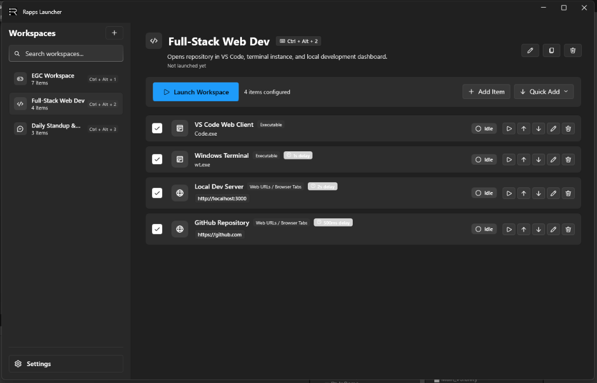
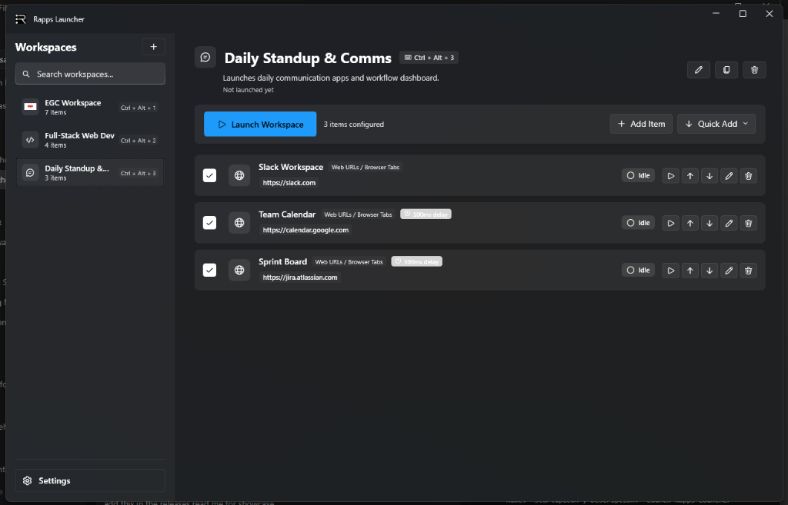
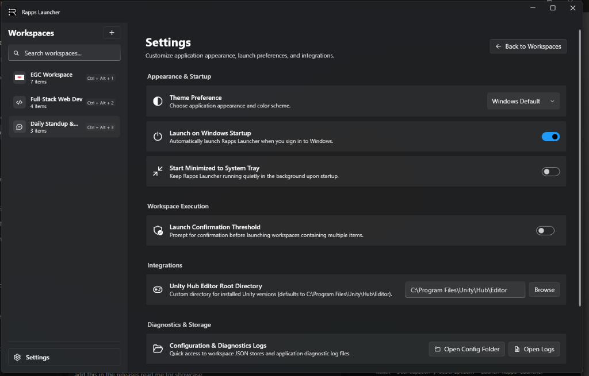

  
  <h1>Rapps Launcher - Releases & Downloads</h1>
  
Official pre-built releases, installers, and distribution packages for <a href="https://github.com/kentrussel-dev/RappsLauncher">Rapps Launcher</a>.

  

    
    
    
  

---

## Downloads (Version 1.3.0)

| Package | Format | Architecture | Download Link |
|---|---|---|---|
| **Windows Setup Wizard (Recommended)** | `.exe` | Windows x64 | **[Download RappsLauncher-Setup-v1.3.0.exe](releases/RappsLauncher-Setup-v1.3.0.exe)** |
| **Portable Zip Package** | `.zip` | Windows x64 | **[Download RappsLauncher-v1.3.0-Portable-win-x64.zip](releases/RappsLauncher-v1.3.0-Portable-win-x64.zip)** |

---

## Showcase

### Multi-Application Workspace Orchestration
Group applications, terminals, web dashboards, and development servers with customized staggered execution delays:

  

### Daily Workflow & Custom Icons
Organize your daily communication tools, browser tab sessions, and project boards with custom workspace logos:

  

### Modern Fluent Settings
Configure startup behaviors, theme preferences, execution thresholds, Unity Hub paths, and diagnostics with an adaptive, responsive interface:

  

---

## What's New in Version 1.3.0

- **Close Applications / Workspace Teardown**: Stop all running applications associated with a workspace in one click using the new **"Close Apps"** button and sidebar context menu.
- **Per-Item Stop Control**: Stop individual running applications from their item row using the dedicated Stop button.
- **Multi-Tier Process Detection**: Intelligently resolves launcher shims (e.g. `blender-launcher.exe` → `blender.exe`), application folder processes, and title fallbacks.
- **Graceful & Safe Teardown**: Requests polite window shutdown first, with guaranteed tree termination for hanging background processes while automatically protecting active browser tabs.
- **Includes all v1.2.1 improvements**: Flexible content-wrapping confirmation dialog, high-contrast delay duration badges, and auto-sizing action buttons.

---

## Installation Guide

### Option 1: Setup Wizard (Recommended)
1. Download **`RappsLauncher-Setup-v1.3.0.exe`** above.
2. Run the installer and follow the prompt instructions.
3. Launch Rapps Launcher from your Start Menu or Desktop shortcut.

### Option 2: Portable ZIP
1. Download **`RappsLauncher-v1.3.0-Portable-win-x64.zip`** above.
2. Extract the archive to your preferred directory.
3. Double-click **`RappsLauncher.exe`** to start the app without installation.

---

  
Maintained by <a href="https://github.com/kentrussel-dev">Kent Russel</a>

